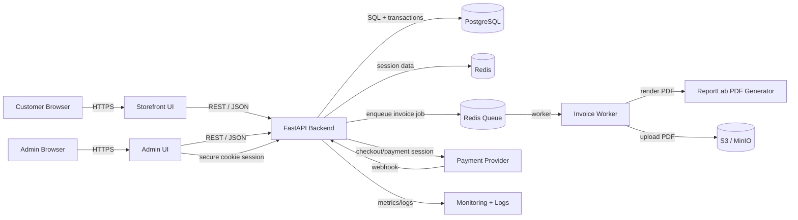

# Architecture

## Overview

This architecture supports the Vinayaka File Works storefront, order workflow, invoice generation, and protected admin operations described in requirements.md. The system is intentionally limited to the storefront use case: product browsing, cart and checkout, order persistence, downloadable PDF invoices, and order processing by an authenticated admin. It does not include unrelated hotel/booking/domain features and is scoped to the actual business workflow requested by the stakeholders.

The solution uses a small but production-aware Python backend (dev/) with a PostgreSQL primary database, Redis for session and queue state, object storage for invoice PDFs, and a separate Playwright + TypeScript test suite under test-automation/. The design follows the design-review findings by fixing the admin auth model, enforcing no-secret repository policies, clarifying the async invoice lifecycle, documenting transactional inventory controls, and defining backup and encryption requirements.

## Component Diagram (Mermaid)

## Data Flow

1. Customer loads the homepage and product catalog from the storefront UI.
2. Product list and detail requests are served from the API and optionally cached in Redis for a short TTL to meet the <500 ms product-list response target.
3. On checkout, the frontend sends a validated order payload to POST /api/orders with an Idempotency-Key header.
4. The backend begins a database transaction, validates cart items, checks product availability, locks affected product rows, and creates the order plus order items. For online payments, the order remains in a pending state until a successful payment webhook confirms payment; for COD, the order is marked confirmed immediately.
5. For a confirmed order, the backend enqueues an invoice-generation job in Redis Queue.
6. The invoice worker renders the PDF, stores it in object storage, and updates the invoice status to ready or failed with retry/error handling.
7. The storefront and admin UI both poll invoice metadata or use a signed URL once the invoice is ready and allow download.
8. Admin users log in through a protected server-side session; they may view submitted orders and update a processed flag.

## Components

| Component | Responsibility | Technology |
|-----------|---------------|------------|
| Storefront UI | Homepage, product catalog, cart, checkout, confirmation, invoice download | React + Vite + TypeScript (or static HTML with minimal JS if adopted) |
| Admin UI | Order list, order details, admin login, status processing | React + Vite + TypeScript |
| API Layer | Request validation, business logic, auth checks, payment orchestration, invoice status APIs | FastAPI, Pydantic, SQLAlchemy |
| Transactions & Locking | Order creation, inventory updates, atomic status transitions | PostgreSQL transactions, SELECT ... FOR UPDATE, optimistic fallback |
| Session Store | Admin auth session storage, rate-limit counters | Redis |
| Queue / Worker | Async invoice generation, retries, failure handling | Redis Queue (RQ) or Celery |
| Invoice Rendering | Deterministic PDF generation to match sample bill layout | ReportLab |
| Object Storage | Invoice PDFs and uploaded product assets | S3 in production, MinIO in local dev |
| Payment Adapter | Checkout initiation and webhook verification for online payment | Stripe or equivalent provider adapter |
| Database | Product catalog, customer/order records, invoice metadata, admin credentials | PostgreSQL (production), SQLite (dev) |
| Observability | Logs, metrics, alerts, uptime checks | OpenTelemetry or CloudWatch/Datadog |
| Test Automation | Browser validation for storefront/admin/invoice flows | Playwright + TypeScript under test-automation/ |

## Data Model

The data model focuses on four core domains: catalog, customer orders, invoice lifecycle, and admin access.

- Product
- product_id (PK)
- sku (unique)
- name
- description
- unit_price_cents
- available_quantity
- image_url (or storage key)
- created_at / updated_at

- Customer
- customer_id (PK)
- full_name
- phone_number
- email
- address_line_1, address_line_2, city, state, pincode
- created_at

- Order
- order_id (PK)
- order_reference (unique)
- customer_id (FK)
- payment_method (cod | online)
- payment_status (pending | paid | failed | refunded)
- order_status (pending | confirmed | processed | cancelled)
- subtotal_cents
- shipping_cents
- total_cents
- created_at / updated_at

- OrderItem
- order_item_id (PK)
- order_id (FK)
- product_id (FK)
- sku_snapshot
- product_name_snapshot
- unit_price_cents
- quantity
- line_total_cents

- Invoice
- invoice_id (PK)
- order_id (FK)
- invoice_number (unique)
- issued_at
- status (pending | generating | ready | failed)
- storage_key
- created_at / updated_at

- AdminUser
- admin_user_id (PK)
- username (unique)
- password_hash (Argon2id hash)
- role (admin | superadmin)
- mfa_enabled
- last_login_at
- created_at / updated_at

- SiteSettings
- setting_key
- setting_value
- used for company name, address, phone number, logo storage key, invoice footer text, and other shared storefront/invoice metadata.

Key relationships:
- One customer has many orders.
- One order has many order items.
- One order has one invoice record.
- One product may appear in many order items.
- Admin users are isolated from customer workflows and only access protected admin routes.

Inventory and transactional rules:
- Order creation occurs inside a DB transaction with row-level locking on affected product rows.
- Quantity checks happen before confirmation of the order and before stock is decremented.
- For online payment, the order is created in a pending state and is only confirmed after a valid payment webhook; if the payment fails or the payment session expires, the order fails and stock is released.
- For COD, stock is decremented only after the order is confirmed; if confirmation fails or is cancelled, the reservation is released.
- If a product row cannot be locked, the API returns a retryable 409 or 423 response and the client retries. This prevents oversell under concurrent checkouts.

## API Surface

| Endpoint / Event | Method | Consumer |
|------------------|--------|----------|
| GET /api/site-settings | GET | Storefront + admin |
| GET /api/products | GET | Customer storefront |
| GET /api/products/:id | GET | Customer storefront |
| POST /api/cart | POST | Customer storefront |
| POST /api/orders | POST | Customer storefront |
| GET /api/orders/:id | GET | Customer storefront + admin |
| GET /api/orders/:id/invoice | GET | Customer storefront |
| POST /api/payments/create-session | POST | Customer storefront |
| POST /api/payments/webhook | POST | Payment provider |
| POST /api/admin/login | POST | Admin UI |
| POST /api/admin/logout | POST | Admin UI |
| GET /api/admin/orders | GET | Admin UI |
| PATCH /api/admin/orders/:id/status | PATCH | Admin UI |
| GET /api/admin/health | GET | Operations |

Async invoice lifecycle events:
- invoice.created
- invoice.generating
- invoice.ready
- invoice.failed
- invoice.retry_scheduled

The workflow is intentionally asynchronous to avoid blocking checkout for invoice rendering, which can be slower or dependent on generated content and object storage writes.

## Technology Stack

| Layer | Technology | Rationale |
|-------|-----------|-----------|
| Backend application | Python + FastAPI | Strong validation, Python ecosystem, easy integration with PDF and queue workloads |
| ORM / database access | SQLAlchemy | Parameterized query support, transactional safety, migration-friendly |
| Primary database | PostgreSQL | ACID compliance and proven order/inventory reliability |
| Migration tooling | Alembic | Versioned schema changes and CI validation |
| Session management / queue | Redis | Server-side admin sessions, rate-limit counters, and async job queue |
| Invoice generation | ReportLab | Deterministic server-side PDF output for layout matching |
| Object storage | S3 (production), MinIO (local) | Durable storage for generated PDFs and product assets |
| Frontend | React + Vite + TypeScript | Responsive UI, static build deployment, developer tooling |
| Admin auth | Argon2id + secure HTTP-only session cookie | Proven password hashing and safer server-side session handling |
| Payment integration | Provider adapter (recommended Stripe) | Provider abstraction keeps payment logic isolated and testable |
| Tests | Playwright + TypeScript under test-automation/ | Browser automation matches the SDLC requirement and supports invoice/admin flows |
| Dev/CI validation | pytest (Python), pre-commit scanning, secret-scanning in CI | Enforces code quality and secret hygiene |

## Security Considerations

- Secrets handling
- No .env file is committed to version control.
- Secret files are excluded via .gitignore and CI blocks additions to tracked secret files.
- Production secrets are stored in a managed secret manager such as AWS Secrets Manager, Azure Key Vault, or a similar provider.
- CI pipeline runs secret scanning before merge using tools like detect-secrets, gitleaks, or equivalent vendor scanning. Local pre-commit hooks are also recommended.

- Admin authentication and authorization
- Password hashes use Argon2id (not a weaker legacy algorithm such as MD5 or SHA-1).
- Admin sessions are stored server-side in Redis and issued via a secure, HTTP-only, SameSite=Lax or Strict cookie; Secure flag is required in production over HTTPS.
- Login API rate limits are enforced per IP and per account; failed login attempts trigger account lockout after a small threshold (for example 5 attempts within 15 minutes).
- Admin routes require authenticated session and authorization checks; role-based access denies non-admin users from order processing actions.
- MFA may be enabled for privileged admin roles, but it is optional in MVP and should be enforced for superadmin accounts.

- Input validation and SQL safety
- All inbound request payloads are validated with Pydantic models.
- All database access uses parameterized SQL / ORM queries; raw SQL is avoided.
- Order items are validated against product stock, pricing rules, and customer inputs before confirmation.
- Payment webhook verification must validate provider signatures and use idempotency keys to prevent double-processing.

- Data protection and encryption
- All production traffic uses TLS 1.2+ (preferably 1.3) with HSTS enabled.
- Database encryption at rest is enabled through the managed provider.
- Object storage buckets are encrypted at rest; access is restricted through IAM roles and signed URLs for invoice downloads.
- Audit logs are created for status changes, payment results, admin sessions, and invoice generation failures; logs do not contain raw secrets or full card data.

- Backup and retention
- PostgreSQL backups run daily with continuous PITR or point-in-time recovery enabled.
- Weekly or monthly snapshots are retained according to a defined period (for example 30-90 days) and restored in quarterly drills.
- Invoice PDFs and supporting metadata are retained according to business/legal retention periods; historical data is not deleted until a documented retention policy is approved.

## Scalability & Reliability

- Stateless application design: the API layer runs behind a load balancer and can scale horizontally.
- Redis-based session and queue services can be clustered or managed independently from the app tier.
- Inventory locking is controlled with database row locking and transaction boundaries to prevent overselling under concurrent order creation.
- Async invoice generation isolates slow PDF work from order submission latency, protecting checkout availability.
- Object storage supports multi-instance deployments without local disk coupling.
- Monitoring covers request latency, 500x rates, queue depth, payment webhook failures, stock reservation errors, and worker retries.
- Product listing is cacheable with a short Redis TTL and invalidated on stock price updates to help satisfy the <500 ms p95 target under normal traffic.
- Backup and restore procedures are tested regularly to protect against data loss and provide recovery confidence.

## Deployment Topology

Local development
- Python code under dev/
- SQLite may be used for local development while PostgreSQL is the target production database.
- Redis runs locally or in Docker for sessions and queue jobs.
- MinIO is used for invoice artifact storage locally.
- .env or OS environment variables are used for local secrets, but these values are never committed.

Staging / test environment
- PostgreSQL staging database with migrations executed via Alembic.
- Redis for admin sessions and invoice queue.
- S3-compatible storage or a test bucket for invoice content.
- Playwright tests under test-automation/ run against the staging app using realistic browser flows.

Production
- Managed PostgreSQL with backups and encryption at rest.
- Managed Redis for sessions and queue processing.
- S3 or equivalent for generated invoice PDFs.
- Application services behind HTTPS load balancer with autoscaling and health checks.
- Secret values injected from a secret manager at deployment time.

## Architecture Decision Records (ADRs)

### ADR-01: Keep architecture aligned to the storefront, order, invoice, and admin workflow
- **Status**: Accepted
- **Context**: The repository originally contained unrelated hotel/booking content and the architecture needed to be refocused to the Vinayaka File Works requirements. Scope confusion creates implementation drift and policy contradictions.
- **Decision**: The system will only include storefront, cart/checkout, order persistence, invoice generation, and protected admin workflows. Unrelated booking/search functionality is explicitly out of scope.
- **Consequences**: Clearer implementation planning and fewer feature conflicts; the project stays small and aligned with the stated business need.

### ADR-02: Use Python FastAPI in dev/ with Playwright TypeScript in test-automation/
- **Status**: Accepted
- **Context**: The SDLC mandates Python code under dev/ and Playwright/TypeScript tests under test-automation/. The prior architecture was ambiguous about test placement and tooling.
- **Decision**: Python backend code and service logic live under dev/. Browser automation and end-to-end tests are implemented in TypeScript under test-automation/ and run in CI separately from backend test suites.
- **Consequences**: Clear repository boundaries and reduced cross-language confusion; a small monorepo remains manageable with folder-specific CI jobs.

### ADR-03: Use PostgreSQL and Alembic for transactional order data
- **Status**: Accepted
- **Context**: Orders and inventory must remain correct under concurrent customer demand. A transactional relational database is required for atomicity and stock integrity.
- **Decision**: PostgreSQL is the production database. Alembic manages schema changes and migration validation in CI. Transactions and row locks protect inventory updates and order creation.
- **Consequences**: Strong consistency and auditability; migration discipline is required, and local development may use SQLite for convenience while the deployment target remains Postgres.

### ADR-04: Enforce Argon2id password hashing and secure server-side admin sessions
- **Status**: Accepted
- **Context**: The design review specifically required precise admin authentication details, including a stronger password hashing strategy and secure session handling.
- **Decision**: Admin passwords are hashed with Argon2id. Administrators authenticate using a server-side session stored in Redis; the session cookie is Secure, HttpOnly, and SameSite-protected. Login endpoints are rate-limited and lock out repeated failures.
- **Consequences**: Stronger admin protection and less risk of credential theft; additional session management infrastructure is required and hardened configuration must be maintained.

### ADR-05: Use async invoice generation with a queue and signed object storage URLs
- **Status**: Accepted
- **Context**: Invoice generation can be slow and should not block checkout. A synchronous PDF generation endpoint is a risk factor for checkout reliability.
- **Decision**: Order confirmation triggers an async invoice job via Redis queue. The worker renders the PDF, uploads it to object storage, and records status transitions. Customers receive a signed URL only when the invoice status is ready.
- **Consequences**: Checkout remains responsive; operational complexity increases due to background workers, retries, and status tracking.

### ADR-06: Secrets are never stored in source control and are injected at runtime
- **Status**: Accepted
- **Context**: The requirements explicitly prohibit committed secrets and require environment-based configuration.
- **Decision**: Secrets are never committed into the repository. Local development uses environment variables; production uses a managed secret manager. CI runs secret scanning and blocks leaks before deployment.
- **Consequences**: Stronger operational security and better compliance; the team must maintain a secret rotation and scanning workflow.

### ADR-07: Backups and encryption-at-rest are part of the core production design
- **Status**: Accepted
- **Context**: The requirement set and review call for explicit backup/restore, encryption, and retention policies.
- **Decision**: PostgreSQL backups include daily automated backups and PITR, with restore verification. Database and object storage encryption-at-rest are enabled. Retention windows and PII handling are documented in operational procedures.
- **Consequences**: Better resilience and compliance; operational overhead increases and restore drills need to be scheduled and tracked.

## Open Questions

- Which payment provider will be used in production: Stripe, Razorpay, or another provider, and what are the local compliance requirements?
- What are the final business contact details and invoice footer content to be used on the public storefront and PDF invoice?
- Is the invoice PDF required to be exact pixel-matched to the sample, or are field-level compliance and general layout sufficient?
- What is the legal retention period for invoices and customer details after order fulfillment?
- Will MFA be mandatory for all admin accounts or only for privileged admin roles during MVP?

These questions do not block the architecture itself but should be resolved before detailed implementation and release sign-off.

